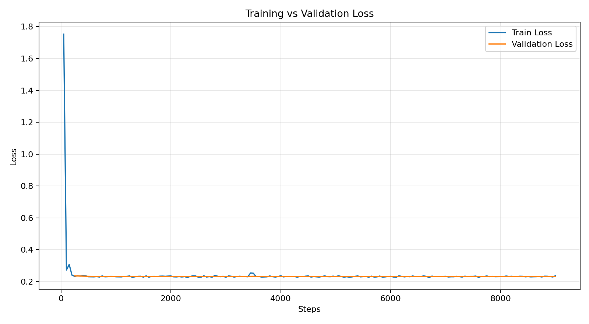

# Generación y validación del dataset GPSR

Este documento describe el funcionamiento actual de `generate_dataset.py`, el
contrato de sus etiquetas, las validaciones que se ejecutan antes de escribir
el dataset y los pasos necesarios para entrenar con `Nl-Cl.py`.

La arquitectura está diseñada para que una orden en lenguaje natural termine
en una secuencia ejecutable por Justina:

```text
CompetitionTemplate
        ↓
CommandGenerator
        ↓
{input, goals, meta}
        ↓
validación del esquema y catálogos
        ↓
deduplicación, balanceo y reintentos
        ↓
validación con goals_planning.clp
        ↓
dataset_gpsr.jsonl
        ↓
Nl-Cl.py → adaptador QLoRA
        ↓
inference.py / server.py
        ↓
qwen_semantic_node.py
        ↓
goals_to_clips_node.py → goals_planning.clp → plan de Justina
```

## 1. Archivos involucrados

### Generación

- `generate_dataset.py`: coordina balanceo, deduplicación, reintentos,
  validación y escritura del JSONL.
- `gpsr_commands.py`: selecciona una familia de comando, resuelve plantillas y
  conserva el contexto de entidades.
- `command_constants.py`: contiene tres realizaciones superficiales por
  familia, verbos, preposiciones, restricciones de slots y catálogos de
  familias de personas y objetos.
- `command_utils.py`: sustituye placeholders, elige follow-ups y propaga el
  contexto entre acciones relacionadas.
- `command_goals.py`: convierte el contexto de una frase en la etiqueta
  semántica `goals`.
- `knowledge.py`: carga nombres, objetos, categorías y ubicaciones desde
  `CompetitionTemplate`.

### Validación y evaluación

- `goal_schema.py`: define la gramática canónica de goals y valida tipos, slots
  y dependencias entre acciones.
- `catalog_validation.py`: detecta duplicados, colisiones y diferencias entre
  CompetitionTemplate y el catálogo de nombres de Justina.
- `dataset_evaluation.py`: calcula cobertura por familia, tipos y slots, y
  ejecuta las reglas CLIPS mediante `clipspy`.
- `evaluate_dataset.py`: permite auditar un JSONL ya generado sin entrenar.
- `evaluate_model.py`: ejecuta un benchmark fijo, mide exactitud semántica,
  planificabilidad y latencia, y crea gráficas y un CSV por caso.
- `model_evaluation_cases.jsonl`: benchmark curado que permite comparar
  entrenamientos sin depender de una muestra aleatoria.
- `test_dataset_quality.py`: contiene pruebas unitarias del contrato y de una
  generación acotada.

### Entrenamiento e inferencia

- `Nl-Cl.py`: carga el JSONL, valida cada fila y entrena el adaptador QLoRA.
- `inference.py`: carga el adaptador y rechaza predicciones que no cumplan el
  esquema canónico.
- `server.py`: mantiene el modelo cargado y expone la inferencia mediante HTTP
  para ejecutarla en otra computadora.
- `test_server.py`: verifica `/health` y `/translate` sin depender de ROS.

## 2. Fuentes de conocimiento

`knowledge.parse_data()` carga los siguientes archivos:

```text
CompetitionTemplate/names/names.md
CompetitionTemplate/maps/location_names.md
CompetitionTemplate/maps/room_names.md
CompetitionTemplate/objects/objects.md
```

De ellos se obtienen:

- nombres de personas;
- objetos concretos;
- categorías de objetos en singular y plural;
- habitaciones;
- ubicaciones y superficies válidas para colocar objetos.

La generación usa CompetitionTemplate como fuente principal. Como protección
contra deriva entre repositorios, `catalog_validation.py` compara también los
nombres con:

```text
$JUSTINA_WS/src/Knowledge/knowledge_bank/dictionaries/names.yaml
```

Si `JUSTINA_WS` no está definido, se usa `~/Justina`.

Ejemplo de configuración:

```bash
export JUSTINA_WS=/home/sergio/Justina
```

### Advertencias y errores de catálogo

Las advertencias se muestran, pero no detienen la generación. Algunos ejemplos
son objetos repetidos, capitalización inesperada o nombres que existen solo en
uno de los dos repositorios.

Los errores sí detienen la generación. Actualmente se consideran errores:

- un catálogo esencial vacío;
- una entidad que aparece simultáneamente como persona y objeto.

La capitalización nunca debe usarse para decidir el tipo de una entidad. Por
ejemplo, `Water` es un objeto aunque empiece con mayúscula.

## 3. Configuración principal

Las constantes al inicio de `generate_dataset.py` controlan la ejecución:

```python
DATA_DIR = "./CompetitionTemplate"
NUM_SAMPLES = 40000
PERSON_RATIO = 0.5
RANDOM_SEED = 42
OUTPUT_FILE = "dataset_gpsr.jsonl"
DEDUPLICATE = True
MAX_ATTEMPTS_PER_SAMPLE = 50
CLIPS_VALIDATION_SAMPLES = 200
```

- `NUM_SAMPLES`: cardinalidad final exacta solicitada.
- `PERSON_RATIO`: proporción reservada para familias de persona. Con `0.5` y
  40,000 muestras se producen exactamente 20,000 de persona y 20,000 de objeto.
- `RANDOM_SEED`: permite repetir la misma generación.
- `DEDUPLICATE`: evita inputs exactos repetidos.
- `MAX_ATTEMPTS_PER_SAMPLE`: controla cuándo una familia se considera saturada.
- `CLIPS_VALIDATION_SAMPLES`: cantidad de secuencias que se ejecutan contra
  CLIPS antes de guardar. El valor `0` valida todas.

## 4. Esquema canónico de goals

El formato de cada etiqueta continúa siendo una lista de strings:

```json
{
  "goals": [
    "go(living room)",
    "find(Robin, kind=person)",
    "follow(Robin, to=kitchen)"
  ]
}
```

### Uso obligatorio de `kind`

`find` y `count` son ambiguos porque pueden operar sobre personas u objetos.
Por eso deben declarar uno de estos valores:

```text
kind=person
kind=object
```

Ejemplos válidos:

```text
find(Adel, kind=person)
find(Water, kind=object)
find(person, kind=person, gesture='waving person')
find(drink, kind=object, property=largest)
count(person, kind=person, pose='standing person')
count(drinks, kind=object)
```

Ejemplos inválidos:

```text
find(Adel)
find(Water)
find(apple, kind=location)
count(person)
find(apple, kind=person, property=largest)
```

Los demás goals tienen un tipo implícito:

- `take`, `deliver`, `place` y `drop` operan sobre objetos;
- `guide`, `follow` y `greet` operan sobre personas;
- `go` opera sobre ubicaciones;
- `tell`, `talk`, `save` y `answer_question` operan sobre información.

### Slots admitidos

| Goal | Slots principales |
|---|---|
| `find` | `kind`, `gesture`, `pose`, `wearing`, `property` |
| `count` | `kind`, `gesture`, `pose`, `wearing`, `property` |
| `deliver` | `to` |
| `place` | `at`, `on`, `in`, `to` |
| `drop` | `at`, `on`, `in` |
| `guide`, `follow` | `to` |

`goal_schema.py` también valida dependencias. Por ejemplo, `place(apple, ...)`
o `deliver(apple, ...)` requieren un `take(apple)` anterior.

También rechaza navegación o transporte redundante, por ejemplo:

```text
go(entrance) -> go(entrance)
go(sofa) -> find(Robin) -> guide(Robin, to=sofa)
```

## 5. Correcciones semánticas incorporadas

### Información de una persona

Una orden como “tell me the pose of the person in the kitchen” produce:

```text
go(kitchen)
find(person, kind=person)
save(pose)
go(instruction_point)
tell(pose)
```

`save` activa la adquisición real de nombre, pose o gesto antes de intentar
reportar la información.

### Transporte entre ubicaciones

`bringObjFromTo` utiliza:

```text
go(source)
find(object, kind=object)
take(object)
place(object, at=destination)
```

La relación `at` evita afirmar que el objeto debe colocarse “encima” de una
ubicación como `entrance` o `coatrack`.

### Clasificación de `takeObjInRoom`

Esta familia pertenece únicamente a `OBJECT_CMD_LIST`. Ya no consume parte de
la cuota reservada a tareas de personas.

### Nuevas firmas simples y compuestas

Se añadieron familias completas para secuencias que antes solo aparecían como
fragmentos de órdenes más largas:

```text
findNameInRoom             -> go -> find(kind=person)
findObjectInRoomSimple     -> go -> find(kind=object)
greetNameInRoomSimple      -> go -> find(kind=person) -> greet
```

Esto distingue explícitamente una orden corta como “go to the living room and
find Robin” de `meetNameAtLocThenFindInRm`, cuya firma correcta es
`go -> find -> go -> find`.

### Superficie separada de la semántica

`TEMPLATE_VARIANTS` contiene tres estructuras sintácticas por familia. Los
generadores de `command_goals.py` continúan siendo la única fuente de la
semántica. `validate_template_variants()` comprueba al iniciar que todas las
paráfrasis de una familia conserven los mismos slots de contenido.

## 6. Construcción de una muestra

`generate_dataset.py` separa deliberadamente la coordinación de la generación
lingüística. Su flujo principal es:

```text
main
 ├─ parse_data                         carga CompetitionTemplate
 ├─ validate_catalogs                  compara y valida entidades
 ├─ generate_balanced_dataset
 │   ├─ discover_family_signatures     enumera firmas realmente alcanzables
 │   ├─ distribute_evenly              reparte cuotas sin sesgo por redondeo
 │   ├─ _try_add_unique_sample
 │   │   └─ CommandGenerator.generate_command_start
 │   │       ├─ _resolve_followups_with_context
 │   │       ├─ insert_all_placeholders_with_context
 │   │       └─ _generate_goals
 │   ├─ _enrich_sample                 añade metadatos de auditoría
 │   └─ fase de redistribución         rellena estratos saturados
 ├─ evaluate_dataset_rows              esquema, cobertura, slots y CLIPS
 └─ escritura JSONL                    persistencia final tras validar
```

La separación tiene dos ventajas prácticas:

- `command_constants.py` controla cómo puede sonar una intención;
- `command_goals.py` controla qué significa, independientemente de la variante
  superficial que se haya elegido.

Para cada estrato `(category, family, goal_signature)`, el generador:

1. fuerza temporalmente la selección de la familia solicitada;
2. resuelve follow-ups y placeholders;
3. genera el texto natural y sus goals;
4. valida los goals con `goal_schema.py`;
5. construye metadatos de auditoría;
6. normaliza el input para detectar duplicados;
7. acepta la muestra o vuelve a intentar.

Ejemplo de salida:

```json
{
  "input": "find Robin in the kitchen and follow them",
  "goals": [
    "go(kitchen)",
    "find(Robin, kind=person)",
    "follow(Robin)"
  ],
  "meta": {
    "family": "meetPrsAtBeac",
    "category": "people",
    "surface_template_id": "meetPrsAtBeac:v2",
    "goal_signature": ["go", "find", "follow"],
    "entity_kinds": ["person"],
    "slot_names": ["kind", "target"]
  }
}
```

Los metadatos sirven para medir el dataset y el modelo. `Nl-Cl.py` no los
incluye en la respuesta aprendida; el target del modelo sigue siendo solamente:

```json
{"goals": ["..."]}
```

### Cómo añadir o modificar comandos

Para añadir solamente otra forma de decir una intención existente, se agrega
una plantilla a `TEMPLATE_VARIANTS` y se conserva el mismo conjunto de
placeholders semánticos. No se debe tocar `command_goals.py`.

Para crear una familia con semántica nueva se requiere:

1. declarar sus variantes superficiales en `command_constants.py`;
2. añadirla a `PERSON_CMD_LIST` u `OBJECT_CMD_LIST`;
3. implementar el método homónimo en `CommandGoalsMixin`;
4. registrarlo en `CommandGenerator.goal_generators`;
5. verificar su firma y dependencias con `goal_schema.py`;
6. añadir un caso estable a `model_evaluation_cases.jsonl`;
7. comprobar que la secuencia resulte planificable en `goals_planning.clp`.

El nombre de la familia conecta la plantilla con el método del parser. Un typo
o una familia registrada sin método debe fallar durante la validación, no
producir una etiqueta parcial.

## 7. Deduplicación, balanceo y reintentos

La clave de deduplicación es el input convertido a minúsculas, con espacios
normalizados. Esto evita que una frase exacta aparezca en entrenamiento y
evaluación.

Si el mismo input aparece con goals diferentes, se registra como
`label_conflict` y se rechaza.

La cuota se reparte jerárquicamente por categoría, familia y firma de goals.
Por ejemplo, las diferentes firmas alcanzables de `goToLoc` reciben cantidades
equivalentes en vez de quedar determinadas por selección aleatoria de
follow-ups.

Algunas familias tienen pocas combinaciones únicas. `simpleGoToLoc`, por
ejemplo, depende principalmente del número de ubicaciones, verbos y tres
superficies. Cuando una familia o firma acumula demasiados rechazos, se
considera saturada. Su déficit se redistribuye empezando por la familia menos
representada y después por su firma menos representada, siempre dentro de la
misma categoría.

La redistribución mantiene simultáneamente:

- la cardinalidad final solicitada;
- la ausencia de duplicados;
- la proporción `people/objects`.

Si no existe suficiente espacio de combinaciones únicas, la ejecución termina
con error en lugar de escribir silenciosamente un dataset incompleto.

## 8. Validación con CLIPS

Antes de escribir el JSONL, `dataset_evaluation.ClipsPlanValidator`:

1. carga `goals_planning.clp` mediante `clipspy`;
2. convierte cada goal en un hecho `(gpsr-goal ...)`;
3. agrega `(start (name action-planning))`;
4. ejecuta las reglas;
5. comprueba que no queden goals pendientes;
6. comprueba que no se active la regla de goal no soportado;
7. exige que se produzca `GPSR_DONE`.

La ruta de reglas se obtiene de:

```text
$JUSTINA_WS/src/Planning/clips/clips_node/clips_rules/goals_planning.clp
```

Si `clipspy` o el archivo de reglas no están disponibles, se informa que la
validación CLIPS no pudo ejecutarse. Las demás validaciones siguen disponibles.

En algunos entornos `clipspy` imprime al cerrar Python:

```text
[ENVRNMNT8] Environment data not fully deallocated
```

Este mensaje procede del binding de CLIPS al destruir el entorno. No significa
que una secuencia haya fallado si el reporte indica `clips_planifiable` y
`GPSR_DONE`.

## 9. Cómo generar el dataset

Desde este directorio:

```bash
cd /home/$USER/Qwen2.5-7B
export JUSTINA_WS=/home/$USER/Justina
python generate_dataset.py
```

La secuencia es:

1. cargar CompetitionTemplate;
2. mostrar advertencias de catálogos;
3. generar y deduplicar;
4. validar esquema y CLIPS;
5. imprimir estadísticas;
6. escribir `dataset_gpsr.jsonl`.

El archivo se escribe solamente después de superar las validaciones.

## 10. Auditar un dataset sin entrenar

Para revisar todo el archivo y ejecutar CLIPS sobre 200 muestras:

```bash
python evaluate_dataset.py dataset_gpsr.jsonl --clips-samples 200
```

Para una comprobación rápida de las primeras 500 filas:

```bash
python evaluate_dataset.py dataset_gpsr.jsonl \
  --max-samples 500 \
  --clips-samples 100
```

Para revisar solo esquema, familias, tipos y slots:

```bash
python evaluate_dataset.py dataset_gpsr.jsonl --no-clips
```

El comando termina con código distinto de cero si encuentra etiquetas inválidas
o secuencias que CLIPS no puede planificar.

## 11. Métricas utilizadas durante el entrenamiento

Después de entrenar, `Nl-Cl.py` evalúa:

- exact match global;
- exact match por `family`;
- validez del esquema generado;
- accuracy de `kind=person` y `kind=object`;
- precisión, recall y F1 de targets y slots;
- planificabilidad CLIPS de las predicciones válidas.

El exact match sigue siendo útil, pero ya no es la única métrica. Una predicción
puede tener el verbo correcto y equivocarse en `kind`, origen, destino, pose o
propiedad; las métricas por slots muestran esas diferencias.

### Benchmark reproducible del adaptador

`evaluate_model.py` carga el adaptador y ejecuta los casos curados de
`model_evaluation_cases.jsonl`. El benchmark cubre las 29 familias, las nuevas
firmas `go -> find`, paráfrasis, pronombres, ruido ASR y un objeto con
mayúscula. A diferencia de la prueba aleatoria al final del entrenamiento, los
casos permanecen fijos y permiten comparar dos checkpoints justamente.

Evaluar el adaptador final y mostrar solamente errores:

```bash
python evaluate_model.py --output-json evaluation_final.json
```

La misma ejecución crea por defecto el directorio `evaluation_plots/`:

| Archivo | Contenido |
|---|---|
| `metrics_overview.png` | exact match, esquema, slots, CLIPS y accuracy de `kind` |
| `family_accuracy.png` | exact match estricto y canónico para cada familia |
| `outcomes_and_latency.png` | aciertos, diferencias solo de mayúsculas, errores y latencias |
| `case_results.csv` | entrada, salida esperada/predicha, familia, tiempos y estado por caso |

Las gráficas usan los resultados que ya están en memoria; no ejecutan el modelo
una segunda vez. Para cambiar el destino se usa `--plots-dir directorio`. Si se
necesita una evaluación sin archivos gráficos, se pasa `--no-plots`.

Mostrar todos los casos, incluidos los correctos:

```bash
python evaluate_model.py --show-all
```

Evaluar una familia específica:

```bash
python evaluate_model.py --family findNameInRoom --show-all
```

Comparar un checkpoint y guardar su reporte:

```bash
python evaluate_model.py \
  --adapter-path nl2cd_qwen7b/checkpoint-8500 \
  --output-json evaluation_checkpoint_8500.json
```

Las métricas incluyen exact match global y por familia, validez del esquema,
accuracy de `kind`, F1 de slots, planificabilidad CLIPS y tiempo de inferencia.
También se reportan `casefold_exact` y `casefold_slots`: conservan toda la
estructura del goal, pero consideran equivalentes diferencias exclusivas de
mayúsculas como `Water`/`water`. El exact match estricto permanece visible para
auditar la consistencia del catálogo.

`--require-perfect` usa por defecto la comparación canónica sin distinción de
mayúsculas. Para exigir también capitalización idéntica:

```bash
python evaluate_model.py --require-perfect --strict-case
```

Esto permite usar el benchmark como prueba de regresión sin penalizar la
normalización esperada de entidades.

La comparación sin mayúsculas no oculta errores de tipo: `find(Water,
kind=object)` y `find(water, kind=person)` continúan siendo diferentes. Solo
acepta que el normalizador convierta la superficie a minúsculas mientras
mantiene exactamente la estructura, el orden, los valores y los slots.

## 12. Preparación para entrenar con `Nl-Cl.py`

### Estado del dataset actual

El `dataset_gpsr.jsonl` incluye las nuevas superficies y familias. Para el
entrenamiento debe generarse con el código actual.

### Checklist obligatorio

1. Respaldar el dataset anterior si se desea conservar.
2. Ejecutar `python generate_dataset.py`.
3. Confirmar que el reporte indique cero etiquetas inválidas.
4. Confirmar que las muestras CLIPS sean planificables.
5. Ejecutar opcionalmente `evaluate_dataset.py` sobre el archivo final.
6. Confirmar que el adaptador `nl2cd_qwen7b` anterior esté respaldado.
7. Iniciar `python Nl-Cl.py` usando nuevamente `nl2cd_qwen7b`.

### Usando `nl2cd_qwen7b`

El entrenamiento anterior está respaldado en un archivo ZIP separado, por lo
que la carpeta habitual puede usarse directamente para el adaptador vigente:

```python
OUTPUT_DIR = "nl2cd_qwen7b"
```

`inference.py` carga exactamente esa misma carpeta:

```python
ADAPTER_PATH = "nl2cd_qwen7b"
```

`Trainer.train()` no reanuda automáticamente un checkpoint anterior mientras
no se pase `resume_from_checkpoint`. Al terminar, el adaptador y tokenizer
nuevos se guardan en `nl2cd_qwen7b`; el ZIP conserva los pesos anteriores si se
necesitan recuperar.

### Inicio del entrenamiento

Después de completar el checklist:

```bash
python Nl-Cl.py
```

El script:

1. valida cada fila;
2. crea el split de entrenamiento y evaluación;
3. aplica el mismo chat template que usa inferencia;
4. enmascara el prompt con `labels=-100`;
5. entrena QLoRA en 4 bits;
6. vuelve a cargar automáticamente el checkpoint con menor `eval_loss` y
   guarda ese adaptador junto con el tokenizer;
7. ejecuta exact match y las métricas semánticas nuevas.

### Qué aprende realmente `Nl-Cl.py`

Cada fila se convierte a una conversación usando el chat template oficial del
tokenizer de Qwen:

```text
user:      go to the kitchen and find Robin
assistant: {"goals":["go(kitchen)","find(Robin, kind=person)"]}
```

El comando sí entra al modelo como contexto, pero sus posiciones en `labels`
se reemplazan por `-100`. PyTorch ignora esas posiciones en la pérdida. De este
modo el modelo aprende a generar la respuesta del asistente y no a repetir el
prompt. `CompletionOnlyCollator` agrega padding dinámico por lote y también usa
`-100` para que el padding no afecte la pérdida.

El modelo base se carga en 4 bits con NF4 y double quantization. QLoRA mantiene
congelados los pesos base e inserta matrices entrenables en:

```text
q_proj, k_proj, v_proj, o_proj,
gate_proj, up_proj, down_proj
```

Los parámetros principales del experimento actual son:

| Parámetro | Valor | Efecto |
|---|---:|---|
| `MAX_LENGTH` | 512 | máximo combinado de prompt y respuesta |
| batch por GPU | 1 | principal consumo instantáneo de memoria |
| acumulación | 8 | batch efectivo de 8 muestras |
| épocas | 2 | dos recorridos por las 36,000 filas de train |
| learning rate | `1e-4` | paso inicial de los adaptadores LoRA |
| LoRA `r / alpha / dropout` | `32 / 64 / 0.05` | capacidad y regularización |
| `eval_steps` | 250 | frecuencia de evaluación |
| `save_steps` | 500 | frecuencia de checkpoints |
| scheduler | cosine, warmup 150 | descenso gradual del learning rate |

Con 36,000 muestras de train, batch efectivo 8 y dos épocas se obtienen 9,000
pasos de optimización. Si se cambia el tamaño del dataset o la acumulación,
también cambian los pasos totales y la proporción que representan 150 pasos de
warmup.

La selección automática se configura con:

```python
load_best_model_at_end=True
metric_for_best_model="eval_loss"
greater_is_better=False
```

`eval_steps=250` y `save_steps=500` son compatibles porque los checkpoints
guardados coinciden periódicamente con pasos de evaluación. `save_total_limit`
conserva el mejor checkpoint aunque no sea el último.

`trainer.save_model()` guarda el adaptador LoRA elegido y no duplica todos los
pesos del Qwen base. El tokenizer sí se guarda en `nl2cd_qwen7b` para que
entrenamiento, inferencia y servidor usen el mismo vocabulario y chat template.

## 13. Pruebas automatizadas

Las pruebas del generador, el contrato y los artefactos gráficos se ejecutan
con:

```bash
python -m unittest -v test_dataset_quality.py test_evaluate_model.py
```

Cubren:

- obligatoriedad de `kind`;
- cardinalidad y deduplicación;
- proporción exacta de categorías;
- metadatos;
- tres superficies por familia y equivalencia de sus slots semánticos;
- balance por firma dentro de cada familia;
- rechazo de origen/destino o navegación redundantes;
- correcciones de `tellPrsInfoInLoc` y `bringObjFromTo`;
- clasificación de `takeObjInRoom`;
- advertencias de catálogo;
- una secuencia representativa de cada familia en CLIPS.

## 14. Inferencia remota con `server.py`

Cuando la computadora de Justina ya ejecuta visión, navegación, audio, CLIPS y
otros nodos ROS2, cargar además Qwen2.5-7B puede provocar presión de RAM/VRAM o
latencias inestables. `server.py` permite mantener el modelo en una computadora
con GPU y dejar en Justina únicamente el cliente HTTP.

```text
Computadora de Justina                         Computadora con GPU
──────────────────────                         ──────────────────
qwen_semantic_node.py
        │ POST /translate {command}
        ├─────────────────────────────────────> server.py
        │                                       ├─ normalización
        │                                       ├─ Qwen base + LoRA
        │                                       └─ validación de goals
        │ {normalized_input, prediction.goals}
        <──────────────────────────────────────┤
qwen_goal_adapter / goals_to_clips / CLIPS
```

El modelo y el tokenizer se cargan una sola vez al iniciar el servidor. Aunque
el servidor acepta conexiones en varios hilos, un lock ejecuta una generación
a la vez para evitar picos de VRAM en una única GPU.

### Iniciar el servidor en la computadora con GPU

```bash
cd /home/$USER/Qwen2.5-7B
export QWEN_API_KEY='cambie-esta-clave'
python server.py \
  --host 0.0.0.0 \
  --port 8008 \
  --adapter-path nl2cd_qwen7b \
  --api-key "$QWEN_API_KEY"
```

Para restringir memoria o repartir capas también están disponibles
`--device-map`, `--max-memory` y `--cpu-offload`. `python server.py --help`
muestra todas las opciones.

Comprobar el servidor desde la red antes de iniciar ROS:

```bash
curl http://IP_DE_LA_GPU:8008/health
python test_server.py \
  "go to the kitchen and find Robin" \
  --url http://IP_DE_LA_GPU:8008 \
  --api-key "$QWEN_API_KEY"
```

`GET /health` indica si el backend está listo, el adaptador cargado y el tiempo
activo. `POST /translate` recibe:

```json
{"command": "go to the kitchen and find Robin"}
```

y responde con `ok`, `elapsed_ms`, `normalized_input` y la predicción validada.
Los códigos más útiles son `400` para una petición inválida, `401` para una
clave incorrecta, `422` para una salida del modelo no válida y `500` para un
fallo interno.

### Conectar `qwen_semantic_node.py` desde Justina

El nodo de Justina ya usa este protocolo. Puede configurarse mediante los
argumentos del launch:

```bash
ros2 launch semantic_parser semantic_parser.launch.xml \
  qwen_url:=http://IP_DE_LA_GPU:8008 \
  qwen_api_key:="$QWEN_API_KEY" \
  qwen_timeout_sec:=30.0 \
  qwen_response_format:=goals
```

En esa terminal, `QWEN_API_KEY` debe contener la misma clave configurada en la
computadora con GPU.

O mediante variables de entorno antes de iniciar el nodo:

```bash
export QWEN_SERVER_URL=http://IP_DE_LA_GPU:8008
export QWEN_API_KEY='la-misma-clave-del-servidor'
export QWEN_TIMEOUT_SEC=30
export QWEN_RESPONSE_FORMAT=goals
```

Si servidor y ROS están en el mismo equipo, se recomienda `--host 127.0.0.1`.
Si se usa `0.0.0.0`, debe configurarse clave, firewall y una red confiable. El
servidor usa HTTP sin cifrado; no debe exponerse directamente a Internet sin
VPN o un proxy con TLS.

## 15. Resultados del entrenamiento actual de 40,000 muestras

El adaptador vigente está en `nl2cd_qwen7b`. El experimento utilizó 36,000
muestras para entrenamiento, 4,000 para validación, batch efectivo 8 y dos
épocas.

| Resultado de entrenamiento | Valor |
|---|---:|
| pasos de optimización | 9,000 |
| tiempo total | 27,513.4 s (7 h 38 min 33 s) |
| muestras por segundo | 2.617 |
| `train_loss` promedio | 0.2464565 |
| `eval_loss` final | 0.2338212 |
| mejor `eval_loss` observado | 0.2337805 (paso 7,500) |

La diferencia entre el mejor valor y el final es aproximadamente `0.000041`,
por lo que la curva terminó esencialmente estable. Este entrenamiento terminó
antes de activar `load_best_model_at_end`; los futuros entrenamientos con el
código actual restaurarán automáticamente el checkpoint de menor `eval_loss`.



El benchmark fijo de 48 comandos produjo:

| Métrica | Resultado |
|---|---:|
| exact match estricto | 47/48 (97.92%) |
| exact match canónico, sin distinguir mayúsculas | 48/48 (100%) |
| F1 de slots estricto | 99.56% |
| F1 de slots canónico | 100% |
| `kind=object` | 17/17 (100%) |
| `kind=person` | 33/33 (100%) |
| esquema válido | 48/48 (100%) |
| planificable en CLIPS | 48/48 (100%) |
| tiempo total / rendimiento | 88.17 s / 0.544 comandos por segundo |

La única diferencia estricta fue `Water` frente a `water`. Como el normalizador
lleva la entrada a minúsculas y conservó correctamente `kind=object`, no es un
error semántico. Por eso se mantienen ambas métricas: la estricta detecta deriva
de superficie y la canónica representa mejor si Justina recibirá el mismo plan.

El archivo `adapter_model.safetensors` ocupa aproximadamente 323 MB. La carpeta
completa puede ser mayor mientras conserve checkpoints intermedios; para
inferencia solo son necesarios el adaptador final, su configuración y los
archivos del tokenizer presentes en la raíz de `nl2cd_qwen7b`.
